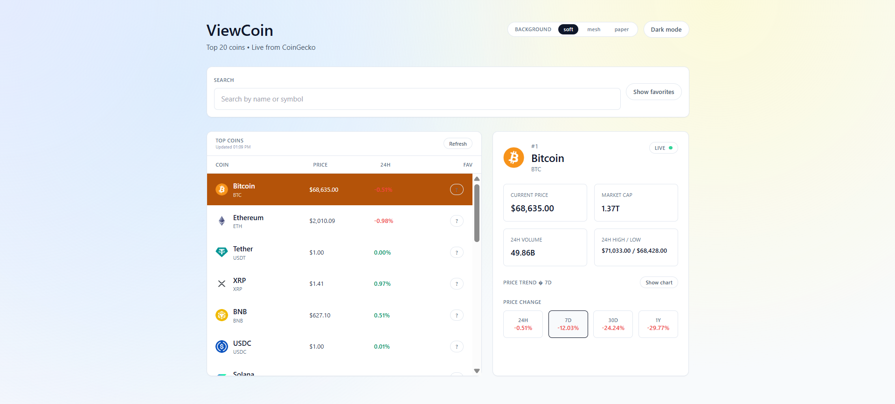
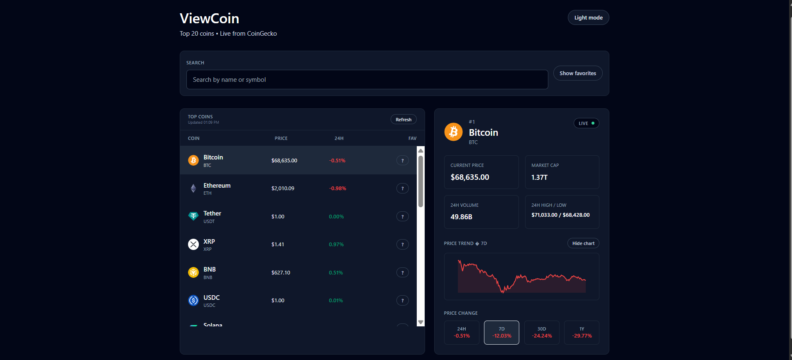
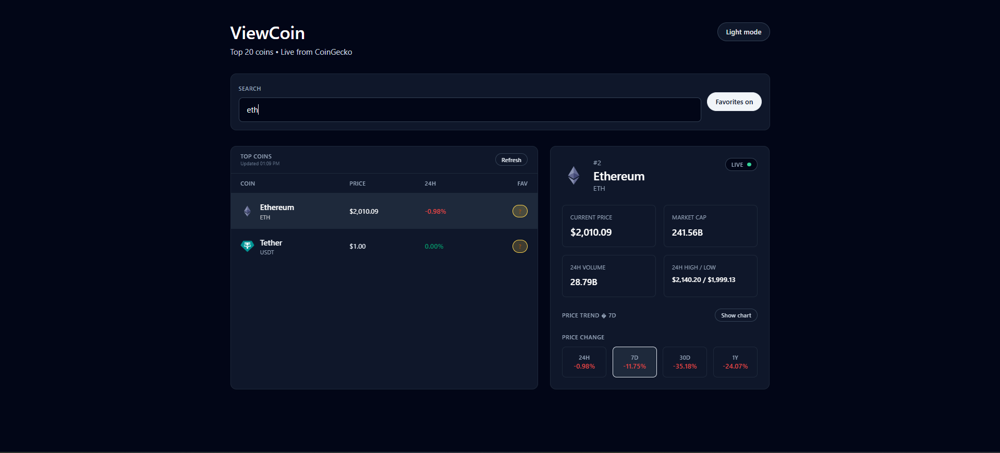

# ViewCoin - Crypto Dashboard

A clean crypto dashboard that lets you explore top coins, track price changes, and view a quick price trend chart. Built as a junior-friendly React project with a clear UI and focused features.

## Features
- Top 20 coins from CoinGecko
- Search by name or symbol
- Favorites list (stored locally)
- Detailed coin panel (price, market cap, volume, 24h high/low)
- Price change cards (24h, 7d, 30d, 1y) that switch the chart range
- Light/dark mode toggle
- Light mode background themes
- Manual refresh with last updated time

## Tech Stack
- React
- TypeScript
- Tailwind CSS
- Vite

## Getting Started
```bash
npm install
npm run dev
```

## Project Structure
```
src/
  components/
    CoinDetails.tsx
    CoinList.tsx
    Header.tsx
    SearchBar.tsx
  App.tsx
  index.css
  main.tsx
  types.ts
```

## Possible Improvements
- Add price alerts and watchlist sorting
- Add chart tooltips/hover details
- Support pagination or a larger coin universe

## Screenshots




## Notes
- Data source: CoinGecko public API
- Favorites and theme preferences are saved in localStorage
